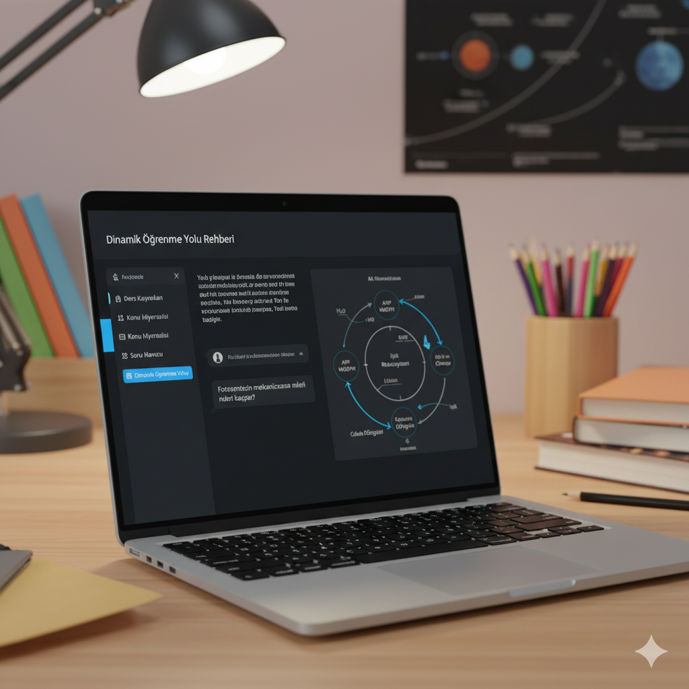

# 📚 Dinamik Öğrenme Yolu Rehberi (Dynamic Learning Path Guide)



Bu proje, yapay zeka destekli, kişiselleştirilmiş ve **çok modlu (multimodal)** bir öğrenme asistanıdır. Öğrencilerin kendi ders materyallerini yüklemelerine, bu materyaller hakkında soru sormalarına ve görselleri (diyagramlar, formüller, grafikler) analiz etmelerine olanak tanır.

Proje, LLM (Büyük Dil Modeli) teknolojilerini **LangChain**, **RAG (Retrieval-Augmented Generation)** ve **Vision** yetenekleriyle birleştiren uçtan uca bir çözümdür.

---

## ✨ Temel Özellikler

| Özellik | Açıklama | Anahtar Teknolojiler |
| :--- | :--- | :--- |
| **Akıllı PDF Analizi** | Kullanıcının yüklediği ders notlarını (PDF) işler, vektörleştirir ve içeriğe dayalı (halüsinasyonsuz) yanıtlar üretir. | LangChain, Qdrant, Google Embeddings |
| **Çok Modlu Analiz** | Ders slaytları, grafikler, formüller veya el yazısı notların fotoğraflarını yükleyerek detaylı açıklama ve adım adım çözüm alma. | Gemini 2.5 Flash **Vision API**, Pytesseract (OCR) |
| **Otomatik Grafik Oluşturma** | Görsel analiz veya metin tabanlı verilerden otomatik olarak grafikler (**Matplotlib**) çizerek veriyi görselleştirir. | Matplotlib, FastAPI |
| **Akıllı Retrieval** | Qdrant üzerinde **MMR (Maximum Marginal Relevance)** algoritması ile en alakalı ve çeşitli dokümanların getirilmesi. | Qdrant, LangChain |
| **Sohbet Hafızası** | Konuşma geçmişi korunur ve takip soruları sorulabilir (**History-Aware Retriever**). | LangChain Session Memory |

---

## 🏗️ Sistem Mimarisi

Proje, birbirine bağlı üç ana Docker Container'ından oluşan mikroservis mimarisi üzerine kurulmuştur.

### 🐳 Teknoloji Stack

| Bileşen | Görev | Temel Teknoloji |
| :--- | :--- | :--- |
| **Frontend (UI)** | Kullanıcı arayüzü, etkileşim, görsel ve PDF yükleme. | **Streamlit** |
| **Backend (API)** | LLM ile iletişim, RAG zincirinin yönetimi, görsel işleme, OCR ve grafik çizimi. | **FastAPI**, **LangChain** |
| **LLM/Embeddings** | Cevap üretimi ve vektörleştirme. | **Gemini 2.5 Flash**, **Google text-embedding-004** |
| **Vector DB** | Vektörleştirilmiş ders notlarının depolanması ve hızlı aranması. | **Qdrant** |

### 🌐 Mimarinin Akışı

Aşağıdaki diyagram, uygulamadaki veri akışını ve servisler arasındaki iletişimi göstermektedir.

```mermaid
graph TD
    A[Streamlit UI :8501] --> B{FastAPI Backend :8000};
    B --> C(Qdrant Vector DB :6333);
    B --> D[Gemini 2.5 Flash / Vision API];
    C --> B;
    D --> B;
